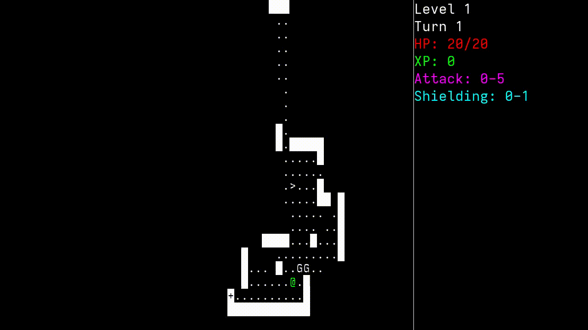

# MyRustRoguelike
[**Web version demo**](https://alex11br.github.io/myrustroguelike-web/)

My first attempt at an app in Rust and at a roguelike. A very simple one, though. And it comes in 2 versions: curses and SDL. Granted, they almost look and behave the same.

## Controls
* Arrow keys / HJKL = move the player
* Enter / Xbox A = descend / collect boost / amulet of Yendor
* Space / Xbox X = wait one turn

## Enemies
There are 9 of them, divided on 3 tiers. The higher the tier, the stronger they are, and the deeper in the dungeon they get placed.

There are 3 kinds of AI for these enemies: chase the player when in sight, move randomly, don't move at all.

|          | Chasers | Randomly moving |    Static     |
|----------|---------|-----------------|---------------|
|**Tier 1**|Gnoll    |Bat              |Animated Statue|
|**Tier 2**|Kestrel  |Emu              |Lazy Imp       |
|**Tier 3**|Troll    |Zombie           |Stone Satan    |
